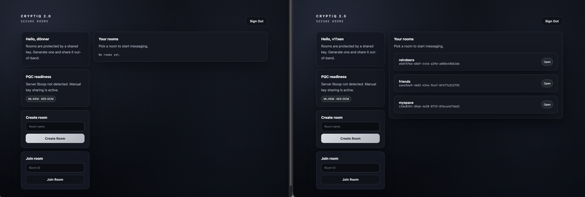
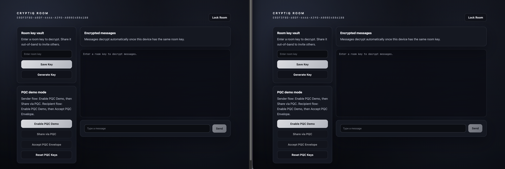
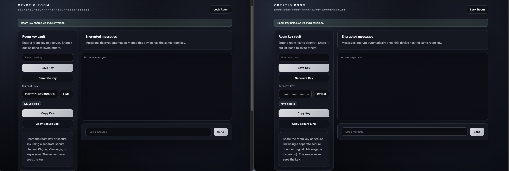
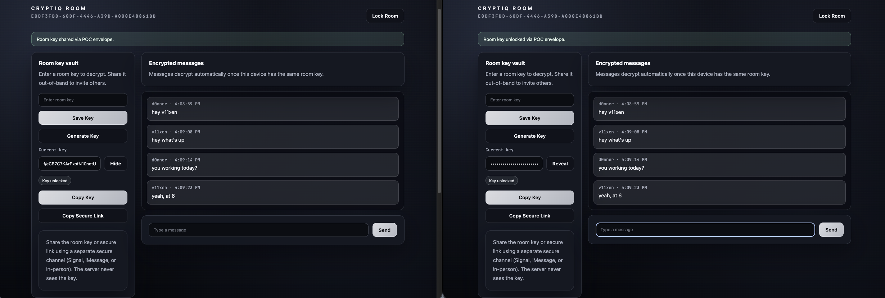
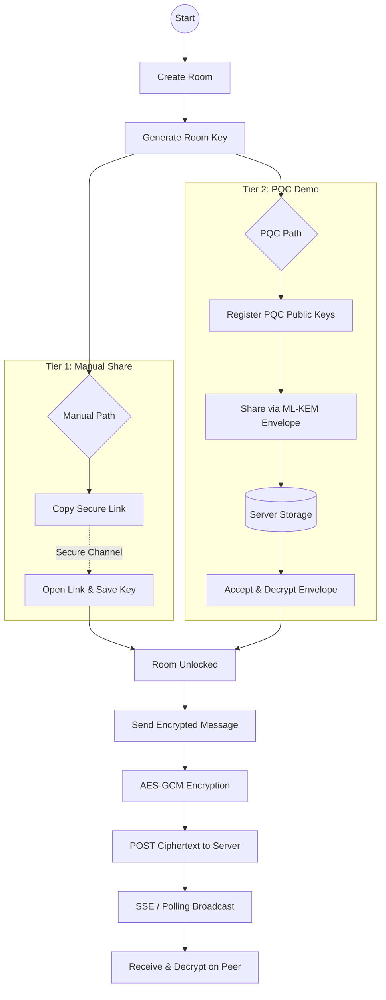

# 𝘊𝘳𝘺𝘱𝘵𝘪𝘘


[](https://www.python.org)
[](https://flask.palletsprojects.com/)
[](https://nextjs.org)
[](https://csrc.nist.gov/Projects/post-quantum-cryptography)
[](https://csrc.nist.gov/Projects/post-quantum-cryptography/selected-algorithms)
[](LICENSE)
[](https://vanessamadison.com)

---

## 𝘖𝘷𝘦𝘳𝘷𝘪𝘦𝘸

**CryptiQ 2.0** is a post-quantum-ready secure messaging platform and reference implementation that pairs a Flask API with a sleek dark-mode client designed for practical demos.

---

## 𝘝𝘪𝘴𝘶𝘢𝘭 𝘗𝘳𝘦𝘷𝘪𝘦𝘸

<p align="center">
  <b>1. Initial Room State</b><br/>
  
</p>

<p align="center">
  <b>2. Encryption Modes & PQC Registration</b><br/>
  
</p>

<p align="center">
  <b>3. Room Key Vault & Secure Unlocking</b><br/>
  
</p>

<p align="center">
  <b>4. End-to-End Encrypted Chat</b><br/>
  
</p>

---

## 𝘚𝘺𝘴𝘵𝘦𝘮 𝘞𝘰𝘳𝘬𝘧𝘭𝘰𝘸



---

## 𝘜𝘴𝘦𝘳 𝘚𝘵𝘰𝘳𝘪𝘦𝘴 & 𝘋𝘦𝘮𝘰 𝘍𝘭𝘰𝘸

### **Story A: The Secure Standard (Manual Share)**
*The primary production-style flow that works across all modern browsers.*

1. **Host:** Create a room and click **Generate Key** in the Room Key Vault.
2. **Host:** Click **Copy Secure Link** (this includes the room ID and the secret key).
3. **Guest:** Open the secure link. The room ID and key are automatically populated.
4. **Guest:** Click **Save Key**. The UI will confirm: *"Room key saved to this device."*
5. **Chat:** Both sides can now send messages. Encryption and decryption happen automatically.

### **Story B: The Post-Quantum Demo (PQC Mode)**
*An advanced demo path using ML-KEM envelopes, optimized for Chromium browsers.*

1. **Setup:** Both users click **Enable PQC Demo** on their respective devices (Chrome/Edge/Brave).
2. **Sender:** Click **Share via PQC**. This wraps the room key in a quantum-resistant envelope.
3. **Recipient:** Click **Accept PQC Envelope**. The device unwraps the key using its local PQC private key.
4. **Result:** The room is unlocked without the secret ever being shared manually or in plaintext.

---

## 𝘞𝘩𝘢𝘵’𝘴 𝘕𝘦𝘸 𝘪𝘯 2.0

CryptiQ 2.0 is substantially more usable and coherent as a PQC portfolio project:

* **Deterministic Key Derivation**
  Fixed a bug where different devices derived different AES keys from the same room secret. Now, shared secrets result in perfect decryption across all clients.

* **Enhanced PQC Reliability**
  Resolved X25519 private key handling errors in Chromium. PQC envelopes now reliably transport room secrets between modern browsers.

* **Live Room Experience**
  - **Auto-Refresh:** New messages appear automatically via event streams with a robust polling fallback.
  - **Intuitive Sending:** Press **Enter** in the message box to send immediately.
  - **Clear Feedback:** Visual indicators confirm when a room key is successfully saved or unlocked.

* **Professional Interface**
  Redesigned with a darker enterprise palette, SF-like typography, and better mobile responsiveness.

---

## 𝘒𝘦𝘺 𝘊𝘢𝘱𝘢𝘣𝘪𝘭𝘪𝘵𝘪𝘦𝘴

* **Post-quantum alignment**
  Uses modern NIST-aligned terminology such as ML-KEM and ML-DSA.

* **Room-key encryption**
  Room secrets are created and retained on the client. The server stores only ciphertext and metadata.

* **Tiered key exchange**
  Manual out-of-band distribution is the reliable default; PQC sharing is the cutting-edge alternative.

* **Browser support**
  - **Manual:** Safari, Chrome, Edge, Brave.
  - **PQC:** Chromium-based (Chrome, Brave, Edge). Safari is currently limited to manual sharing.

---

## 𝘏𝘪𝘨𝘩 𝘓𝘦𝘷𝘦𝘭 𝘈𝘳𝘤𝘩𝘪𝘵𝘦𝘤𝘵𝘶𝘳𝘦

```text
cryptiq/
├── backend/              Flask API and auth layer
│   ├── app.py            REST API + JWT auth + room streams
│   ├── db.py             SQLite models and schema
│   └── requirements.txt  Python dependencies
├── frontend/             Next.js client application
│   ├── app/              App Router UI
│   ├── public/           Static assets + PQC wasm
│   ├── scripts/          Build helpers
│   └── package.json      Frontend dependencies
└── README.md             Overview, flows, deployment, and setup
```

Core concepts:

* Backend Flask service for auth, rooms, room membership, device key registration, PQC envelopes, and encrypted message storage
* Client-side AES-GCM message encryption with a per-room secret
* Optional ML-KEM envelope exchange for demonstration purposes
* Shared room model designed for a concrete portfolio demo rather than a vague crypto showcase

---

## 𝘛𝘦𝘤𝘩 𝘚𝘵𝘢𝘤𝘬

**Backend**

* Python + Flask
* SQLite for lightweight state
* JWT auth with room membership checks
* SSE stream endpoint for near-real-time message delivery

**Frontend**

* Next.js + React
* Web Crypto API with AES-GCM
* PBKDF2-derived room encryption keys
* Optional browser-side PQC WebAssembly with ML-KEM

**Deployment**

* Vercel for frontend hosting
* External Flask host for backend API

---

## 𝘋𝘦𝘱𝘭𝘰𝘺𝘦𝘥 𝘌𝘯𝘷𝘪𝘳𝘰𝘯𝘮𝘦𝘯𝘵

Current deployment targets:

* **Frontend**
  `https://frontend-lovat-xi-33.vercel.app`

* **Backend**
  `https://cryptiq-illapex-d0a26100.koyeb.app`

If you redeploy the frontend, ensure `NEXT_PUBLIC_API_BASE` points at the backend URL above or your replacement backend host.

---

## 𝘘𝘶𝘪𝘤𝘬 𝘚𝘵𝘢𝘳𝘵

**Requirements**

* Python 3.9 or newer
* Node.js 18 or newer

```bash
# Backend
cd backend
python -m venv venv
source venv/bin/activate
pip install -r requirements.txt
python app.py   # Flask on :5000

# Frontend (new terminal)
cd frontend
npm install
npm run dev     # Next.js on :3000
```

Access:

```text
Frontend: http://localhost:3000
Backend:  http://localhost:5000
```

---

## 𝘓𝘰𝘤𝘢𝘭 𝘋𝘦𝘷 𝘕𝘰𝘵𝘦𝘴

* Room keys are device-local and should be shared intentionally during testing
* Older messages created before the deterministic room-key fix may not decrypt correctly in previously used rooms
* For the cleanest demo, create a fresh room after pulling the latest changes
* If PQC demo mode was tested before the latest key-handling fix, use **Reset PQC Keys** before re-enabling it

---

## 𝘚𝘦𝘤𝘶𝘳𝘪𝘵𝘺 𝘔𝘰𝘥𝘦𝘭

CryptiQ 2.0 currently focuses on these security properties:

* Client-held room keys
* AES-GCM encryption for message payloads
* JWT-secured API access and room membership enforcement
* Server stores only ciphertext, nonces, and room metadata
* Manual out-of-band key delivery as the primary usable model
* Optional PQC envelope exchange as a separate demonstration path

Important limitation:

* The current PQC mode is a browser-side demonstration layer, not a full audited end-to-end production PQC system

---

## 𝘙𝘰𝘢𝘥𝘮𝘢𝘱

* QR code room sharing for mobile demos
* Cleaner advanced-mode separation for PQC controls
* Full backend liboqs integration where available
* Better persistence and multi-device identity handling
* Optional hardware-backed local key storage

---

## 𝘓𝘪𝘤𝘦𝘯𝘴𝘦 𝘢𝘯𝘥 𝘊𝘰𝘯𝘵𝘢𝘤𝘵

CryptiQ is released under the MIT License. See the [LICENSE](LICENSE) file for details.

**Author**: Vanessa Madison
**Site**: [vanessamadison.com](https://vanessamadison.com)

For research collaboration or security review discussions, open an issue or reach out through the contact details on the site.
